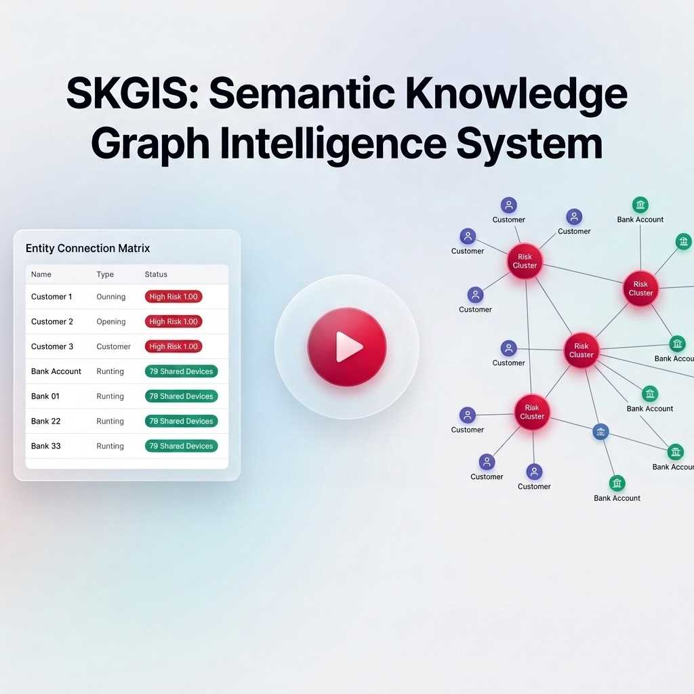

# Semantic Knowledge Graph Intelligence System (SKGIS)

> **One-Line Pitch**: A Java/Spring Boot + Neo4j system that builds a knowledge graph of customers, merchants, devices, and bank accounts from transaction data, then uses graph algorithms + explainable rules to detect fraud rings that row-based ML models miss because each transaction is scored independently.

**Track**: Track 2: AI Risk Manager

---

## 1. Problem Statement

Traditional payment risk engines evaluate payments row-by-row. When assessing a transaction, standard machine learning models inspect isolated features like amount, timestamp, location, and user velocity. 

Organized fraud syndicates exploit this limitation by deploying synthetic customer identities that perform low-value, seemingly innocuous transactions. In isolation, every transaction scores as low risk. However, behind the scenes, these synthetic identities share physical mobile devices or destination bank accounts. **SKGIS provides a graph-native relationship risk layer** that models multi-entity connections and runs community detection algorithms to catch syndicate fraud rings in real time.

---

## 2. System Architecture

```
                                  +---------------------------------------+
                                  |    PaySim Synthetic Transaction CSV   |
                                  +---------------------------------------+
                                                      |
                                                      v
                                  +---------------------------------------+
                                  |      Spring Batch / Ingestion Engine  |
                                  | (Entity Resolution & Synthetic Device |
                                  |       & Account Augmentation)         |
                                  +---------------------------------------+
                                                      |
                                                      v
                                  +---------------------------------------+
                                  |      Neo4j 5.x Graph Database         |
                                  |  (Customer, Device, Account, Merchant)|
                                  +---------------------------------------+
                                                      |
                                                      v
                                  +---------------------------------------+
                                  |    GDS Louvain Community Detection    |
                                  |   + Explainable Rule Engine Scoring   |
                                  +---------------------------------------+
                                                      |
                                                      v
                                  +---------------------------------------+
                                  |        Spring Boot REST API           |
                                  |      (/api/risk & /api/graph)         |
                                  +---------------------------------------+
                                                      |
                                                      v
                                  +---------------------------------------+
                                  |       vis.js Interactive Explorer     |
                                  |    (Single-Page Graph Visualizer)     |
                                  +---------------------------------------+
```

---

## 3. Visual Demo & Explorer

[](https://drive.google.com/file/d/1UvBuoq9ek4iTzHAqb0NHPkwxLbzk0cK0/view?usp=sharing)
*Click thumbnail above to watch the 3-minute executive walkthrough video.*

---

## 4. Quickstart — Running in One Command

### Prerequisites
- Java 17 LTS
- Maven 3.8+
- Docker & Docker Compose

### Launch Demo Pipeline
```bash
./scripts/run_demo.sh
```
This script automatically:
1. Launches Neo4j 5.x container pre-loaded with Graph Data Science (GDS) 2.6.
2. Generates/prepares sample transaction data.
3. Builds and runs the Spring Boot application.
4. Triggers CSV ingestion and Louvain risk detection pipelines via REST APIs.
5. Launches the interactive vis.js graph visualizer (`frontend/index.html`).

---

## 5. Technology Stack

| Layer | Technology | Function |
|---|---|---|
| Language | Java 17 LTS | Core Runtime |
| Framework | Spring Boot 3.2.5 | REST Controllers & Batch Ingestion |
| Graph Database | Neo4j 5.18.0 Community Edition | Graph Persistence |
| Graph Algorithms | Neo4j GDS Plugin 2.6.x | Louvain Community Detection & PageRank |
| Rules Engine | Custom Java Explainable Rules | Rule Evaluation & Risk Score Aggregation |
| Ingestion | Apache Commons CSV + Batched UNWIND | High-Throughput Cypher Writes |
| Visualizer | vis.js Network | Single-Page Interactive Web Explorer |
| Containerization| Docker Compose | Infrastructure Orchestration |

---

## 6. Sample API Output (Explainable Risk Cluster)

`GET /api/graph/cluster/CLUSTER-1`
```json
{
  "clusterId": "CLUSTER-1",
  "score": 0.90,
  "reasons": [
    {
      "rule": "SharedDeviceRule",
      "explanation": "4 customers share Device DEV-RING-0042",
      "evidenceEntityIds": ["DEV-RING-0042", "C1001", "C1002", "C1003", "C1004"]
    },
    {
      "rule": "SharedAccountRule",
      "explanation": "2 customers share Bank Account ACC-RING-0091",
      "evidenceEntityIds": ["ACC-RING-0091", "C1001", "C1002"]
    }
  ],
  "nodes": [
    { "id": "CLUSTER-1", "label": "CLUSTER-1", "type": "RiskCluster" },
    { "id": "C1001", "label": "C1001", "type": "Customer" },
    { "id": "C1002", "label": "C1002", "type": "Customer" },
    { "id": "C1003", "label": "C1003", "type": "Customer" },
    { "id": "C1004", "label": "C1004", "type": "Customer" },
    { "id": "DEV-RING-0042", "label": "DEV-RING-0042", "type": "Device" },
    { "id": "ACC-RING-0091", "label": "ACC-RING-0091", "type": "BankAccount" }
  ],
  "edges": [
    { "from": "C1001", "to": "DEV-RING-0042", "type": "USED_DEVICE" },
    { "from": "C1002", "to": "DEV-RING-0042", "type": "USED_DEVICE" },
    { "from": "C1003", "to": "DEV-RING-0042", "type": "USED_DEVICE" },
    { "from": "C1004", "to": "DEV-RING-0042", "type": "USED_DEVICE" },
    { "from": "C1001", "to": "ACC-RING-0091", "type": "OWNS_ACCOUNT" },
    { "from": "C1002", "to": "ACC-RING-0091", "type": "OWNS_ACCOUNT" },
    { "from": "C1001", "to": "CLUSTER-1", "type": "MEMBER_OF" }
  ]
}
```

---

## 7. Business Framing & Integration

SKGIS is designed as a complementary intelligence layer to existing payment engines (such as Thirdwatch / Razorpay Risk Engine). Rather than replacing per-transaction ML scoring, SKGIS acts asynchronously to detect cross-account fraud syndicates and outputs human-readable explainability logs.

---

## 8. Data Augmentation Transparency

*Note on Data Preparation*: Standard public PaySim datasets contain transaction amounts and customer IDs but lack raw device fingerprints and bank account numbers. During CSV processing, SKGIS synthetically derives `deviceId` and `bankAccountId` values using deterministic hashing with a controlled overlap pool. This models realistic fraud syndicate behavior and ensures deterministic ring detection during testing and demonstration.

---

## License
MIT License.
